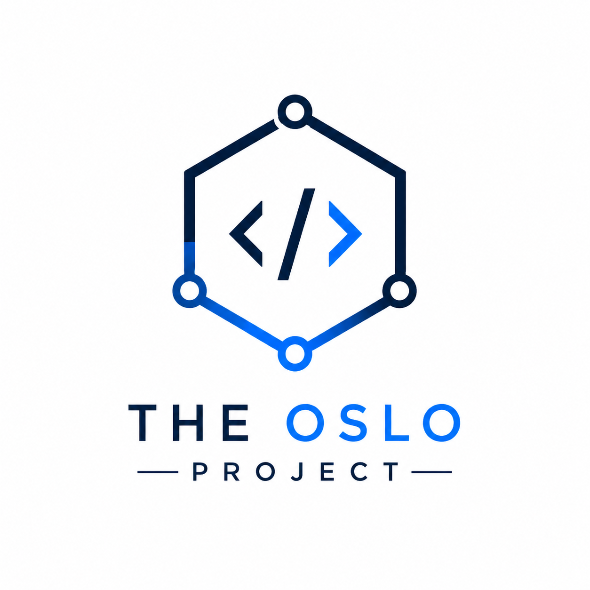

# The Oslo Project

Sistem Informasi Manajemen Magang Terintegrasi berbasis web dan mobile-first yang dirancang untuk memfasilitasi proses pengajuan, monitoring, evaluasi, dan pengelolaan kegiatan magang mahasiswa secara real-time. Sistem mendukung kolaborasi antara mahasiswa, dosen pembimbing, program studi, dan mitra/perusahaan dalam satu platform terpusat.

---

## Overview

The Oslo Project dikembangkan untuk menyelesaikan berbagai permasalahan pada sistem magang konvensional, seperti:

- Monitoring yang tidak real-time
- Pengelolaan data yang tidak terintegrasi
- Proses pelaporan manual
- Komunikasi antaraktor yang tidak terstruktur
- Keterbatasan skalabilitas sistem

Sistem ini menerapkan pendekatan terintegrasi dengan dukungan multi-role dan dashboard monitoring untuk meningkatkan efektivitas pengelolaan magang akademik.

---

## Features

### Mahasiswa
- Pengajuan magang
- Upload laporan dan logbook kegiatan
- Monitoring status pengajuan
- Melihat hasil evaluasi dan penilaian
- Tracking progress magang

### Dosen Pembimbing
- Monitoring aktivitas mahasiswa
- Review laporan magang
- Memberikan feedback dan bimbingan
- Penilaian mahasiswa

### Program Studi
- Validasi pengajuan magang
- Manajemen data mahasiswa dan mitra
- Monitoring keseluruhan aktivitas magang
- Rekapitulasi laporan dan penilaian

### Mitra Magang
- Validasi aktivitas mahasiswa
- Evaluasi performa mahasiswa
- Pengelolaan informasi lowongan dan role magang

---

## Tech Stack

### Frontend
- HTML5
- CSS3
- JavaScript

### Backend
- Laravel / Node.js

### Database
- MySQL / PostgreSQL

### Deployment & Infrastructure
- Docker
- Nginx
- Staging & Production Environment

---

## System Characteristics

- Real-time / Near Real-time System
- Role-Based Authentication & Authorization
- Centralized Database Management
- Mobile-Friendly Interface
- Scalable Architecture
- Backup & Recovery Support

---

## User Roles

| Role | Description |
|------|-------------|
| Mahasiswa | Mengajukan dan melaporkan kegiatan magang |
| Dosen Pembimbing | Membimbing dan mengevaluasi mahasiswa |
| Program Studi | Mengelola dan memonitor keseluruhan sistem |
| Mitra Magang | Melakukan validasi dan evaluasi kegiatan magang |
